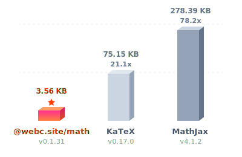
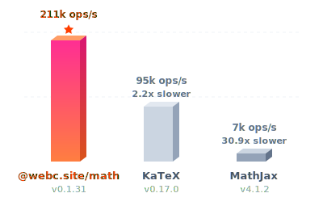
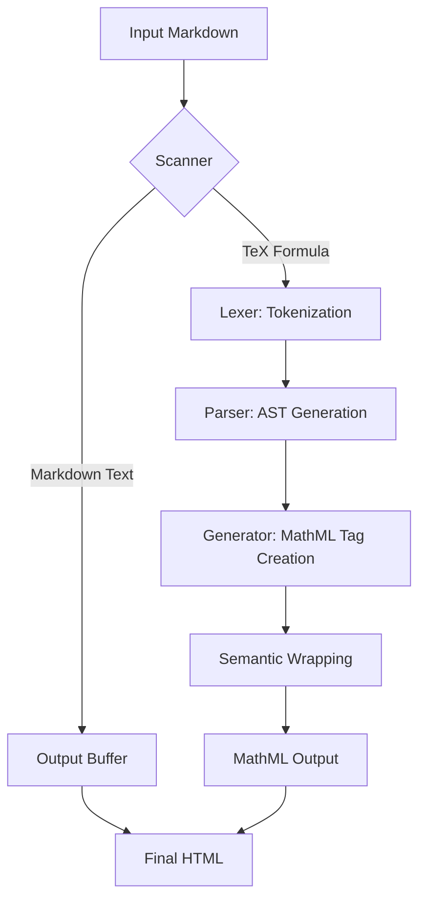
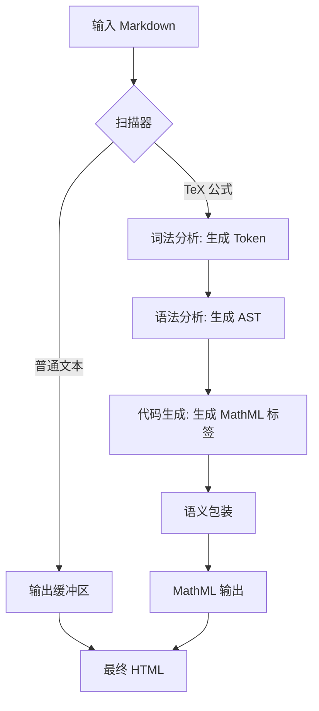

[English](#en) | [中文](#zh)

---

<a id="en"></a>

# @webc.site/math

### The world's smallest and fastest web Markdown formula renderer

<a href="https://www.npmjs.com/package/@webc.site/math" target="_blank"></a>
&nbsp;&nbsp;
<a href="https://github.com/webc-site/math" target="_blank"></a>
&nbsp;&nbsp;
<a href="https://math.webc.site" target="_blank"></a>

The world's smallest and fastest web Markdown formula renderer designed to parse mathematical formulas within Markdown text.

- [Usage](#usage)
- [Features](#features)
- [Supported Syntax List](#supported-syntax-list)
- [What is MathML?](#what-is-mathml)
  - [Why Compile TeX Formulas to MathML?](#why-compile-tex-formulas-to-mathml)
- [Benchmark](#benchmark)
- [Design and Calling Process](#design-and-calling-process)
- [How to Add Syntax Support](#how-to-add-syntax-support)
- [Tech Stack](#tech-stack)
- [Directory Structure](#directory-structure)
- [History and Background](#history-and-background)

## Usage

### JavaScript Example

#### 1. Replace Formulas in Markdown (using `@webc.site/math/md`)

Parses Markdown text, automatically identifying and replacing inline/block equations with MathML.

```javascript
import mdMath from "@webc.site/math/md";

const markdown = "Euler's identity: $$e^{i\\pi} + 1 = 0$$";
const html = mdMath(markdown);

console.log(html);
// Output: Euler's identity: <math xmlns="http://www.w3.org/1998/Math/MathML" display="block"><semantics><mrow><msup><mi>e</mi><mrow><mi>i</mi><mi>π</mi></mrow></msup><mo>+</mo><mn>1</mn><mo>=</mo><mn>0</mn></mrow><annotation encoding="application/x-tex">e^{i\pi} + 1 = 0</annotation></semantics></math>
```

#### 2. Render TeX Formulas Directly (using `@webc.site/math`)

Compiles TeX formulas directly to MathML. Useful for implementing math rendering plugins for Markdown parsers (e.g., markdown-it, marked).

```javascript
import mathml from "@webc.site/math";

const tex = "e^{i\\pi} + 1 = 0";
const html = mathml(tex, true); // true for block math, false/empty for inline math
```

### CSS and Math Font Configuration

For browser mathematical layout engines to present beautifully typeset math equations, we highly recommend using a math font. The **Latin Modern Math** font provided in the `18s` package is recommended (derived from Knuth's classical Computer Modern typeface, with a complete mathematical symbol set and OpenType MATH table support).

#### 1. Online Reference (Recommended)

You can import the online font directly in your CSS:

```css
/* Import the bundle (includes Source Han Sans t, monospace c, and math font m) */
@import url("//registry.npmmirror.com/18s/0.2.24/files/_.css");
```

Or import the math font `m` only:

```css
@import url("//registry.npmmirror.com/18s/0.2.24/files/m.css");
```

#### 2. Local Installation

```bash
npm install 18s
```

##### Import Local Font

Depending on your project setup, choose one of the following methods to import the font mappings (Note: do not mix JS and CSS imports in the same file):

###### Method 1: Import in JS/TS Entry File

```javascript
// Import the bundle (includes Source Han Sans t, monospace c, and math font m)
import "18s/_.css";
```

Or import math font `m` only:

```javascript
import "18s/m.css";
```

###### Method 2: Import in CSS Stylesheet

```css
/* Import the bundle (includes Source Han Sans t, monospace c, and math font m) */
@import "18s/_.css";
```

Or import math font `m` only:

```css
@import "18s/m.css";
```

#### 3. Configure CSS Style

Set the `math` tag to use font family alias `m` (where `t` is Source Han Sans, optimized with font slicing for Chinese characters) in your global CSS styles:

```css
math {
  /* m is the math font, t is Source Han Sans (optimized with font slicing for Chinese characters to boost loading performance), sans-serif is default fallback */
  font-family: m, t, sans-serif;
}
```

## Features

- **Highly Complete Features**: Extracted and compiled thousands of mathematical formulas from KaTeX and MathJax official test suites, passing all test cases successfully (see [extract](https://github.com/webc-site/math/tree/dev/extract) for details).
- **Robust & Fault-Tolerant**: When parsing Markdown text, syntax errors (such as unclosed `\left`/`\right` or invalid syntax) are caught automatically and gracefully degraded, returning the raw TeX code to prevent application crashes.
- **Fast Compiler**: Compiles TeX formulas directly to semantic MathML without external parser dependencies.
- **Markdown Integration**: Automatically parses inline math (`$formula$`) and block math (`$$formula$$`) in Markdown text.
- **High Performance**: Only 7.78 KB raw size (3.58 KB gzipped), far smaller than KaTeX and MathJax (see size comparison chart below):

  | Library                                                     | Raw Size  | Gzip Size | Size Ratio |
  | :---------------------------------------------------------- | :-------: | :-------: | :--------: |
  | [@webc.site/math](https://github.com/webc-site/math) (Ours) |  7.78 KB  |  3.58 KB  |   1.0 ⭐️   |
  | [KaTeX](https://github.com/KaTeX/KaTeX)                     | 264.79 KB | 75.15 KB  |    21.0    |
  | [MathJax](https://github.com/mathjax/MathJax)               | 971.04 KB | 278.39 KB |    77.7    |

  

- **Standard Compatibility**: Outputs valid MathML elements supported by modern browser layout engines.

## Supported Syntax List

Designed to be extremely lightweight, this library supports the most commonly used math typesetting syntaxes:

- **Basic Arithmetic & Symbols**: Numbers, English letters, basic operators (`+`, `-`, `*`, `/`, `=`, `<`, `>`, `(`, `)`, `[`, `]`, `.`). Note that `-` automatically maps to minus sign `\u2212`, `*` maps to asterisk `\u2217`, and `/` is rendered in upright normal font.
- **Subscripts & Superscripts**:
  - Superscript `^` (e.g., `x^2`)
  - Subscript `_` (e.g., `x_i`)
  - Simultaneous subscripts/superscripts (e.g., `x_i^2` or `x^2_i`)
  - Big operators automatically render limits layout for subscripts and superscripts (e.g., `\sum_{i=1}^n`, `\int_a^b`)
- **Fractions**: `\frac{numerator}{denominator}` (e.g., `\frac{a}{b}`)
- **Square Roots**: Square root `\sqrt{x}` and $n$-th root `\sqrt[n]{x}`
- **Overlines & Bars**: `\overline{x}` and the shorthand `\bar{x}`
- **Adaptive Delimiters**: `\left` and `\right` structures for autosizing delimiters (e.g., `\left( ... \right)`). Supported delimiters include:
  - Parentheses: `(` and `)`
  - Square brackets: `[` and `]`
  - Curly braces: `\{` and `\}`
  - Angle brackets: `<` (⟨) and `>` (⟩)
  - Vertical bars: `|` or `\|`
  - Null/Empty delimiter: `.` (shows no delimiter on that side, e.g., `\left. \frac{df}{dx} \right| _0`)
- **Text Mode**: `\text{...}` (e.g., `\text{if }`), extracts literal text inside braces and renders it as MathML `<mtext>` in normal upright font.
- **Horizontal Spacing**: Supports `\quad` (1em space) and `\qquad` (2em space) horizontal spacing.
- **Styles, Strikethroughs & Phantom**:
  - Borders: `\boxed{...}` (adds a border around the formula, e.g., `\boxed{x+y}`)
  - Strikethroughs: `\cancel{...}` (crosses out with a diagonal line, e.g., `\cancel{x}`) and `\sout{...}` (crosses out with a horizontal line, e.g., `\sout{y}`)
  - Hiding & Spacing: `\phantom{...}` (renders an invisible placeholder with the same width and height as the argument, e.g., `\phantom{x}`)
- **Common Functions**: `\sin`, `\cos`, `\tan`, `\cot`, `\sec`, `\csc`, `\log`, `\lg`, `\ln`, `\lim`, `\exp`, `\max`, `\min`, `\sup`, `\inf`, `\det`, `\gcd`, `\arcsin`, `\arccos`, `\arctan`, `\sinh`, `\cosh`, `\tanh`, `\coth`, `\deg`, `\arg`. Note that limit-like operators (`\lim`, `\max`, `\min`, `\sup`, `\inf`) render with limits layout (above/under) for subscripts and superscripts in display/block math mode.
- **Modulo parentheses**: `\pmod{...}` (generates parenthesized modulo, e.g., `\pmod{m}` renders as $(mod\ m)$)
- **Greek Letters**:
  - Lowercase: `\alpha` ($\alpha$), `\beta` ($\beta$), `\gamma` ($\gamma$), `\delta` ($\delta$), `\epsilon` ($\epsilon$), `\zeta` ($\zeta$), `\eta` ($\eta$), `\theta` ($\theta$), `\iota` ($\iota$), `\kappa` ($\kappa$), `\lambda` ($\lambda$), `\mu` ($\mu$), `\nu` ($\nu$), `\xi` ($\xi$), `\pi` ($\pi$), `\rho` ($\rho$), `\sigma` ($\sigma$), `\tau` ($\tau$), `\upsilon` ($\upsilon$), `\phi` ($\phi$), `\chi` ($\chi$), `\psi` ($\psi$), `\omega` ($\omega$)
  - Uppercase (rendered upright): `\Delta` ($\Delta$), `\Gamma` ($\Gamma$), `\Theta` ($\Theta$), `\Lambda` ($\Lambda$), `\Xi` ($\Xi$), `\Pi` ($\Pi$), `\Sigma` ($\Sigma$), `\Upsilon` ($\Upsilon$), `\Phi` ($\Phi$), `\Psi` ($\Psi$), `\Omega` ($\Omega$)
- **Operators & Relations**:
  - `\le` / `\leq` ($\le$), `\ge` / `\geq` ($\ge$), `\ne` / `\neq` ($\ne$)
  - `\cdot` ($\cdot$), `\times` ($\times$), `\pm` ($\pm$), `\mp` ($\mp$), `\div` ($\div$), `\infty` ($\infty$)
  - `\approx` ($\approx$), `\sim` ($\sim$), `\cong` ($\cong$), `\propto` ($\propto$), `\equiv` ($\equiv$), `\perp` ($\perp$), `\parallel` ($\parallel$)
- **Calculus, Sets & Logic**:
  - Gradient: `\nabla` ($\nabla$), Partial derivative: `\partial` ($\partial$)
  - Logic quantifiers & operations: `\forall` ($\forall$), `\exists` ($\exists$), `\neg` ($\neg$), `\land` ($\land$), `\lor` ($\lor$)
  - Set relations: `\in` ($\in$), `\notin` ($\notin$), `\ni` ($\ni$), `\subset` ($\subset$), `\supset` ($\supset$), `\subseteq` ($\subseteq$), `\supseteq` ($\supseteq$)
  - Set operations: `\cup` ($\cup$), `\cap` ($\cap$), Empty set: `\emptyset` ($\emptyset$)
  - Special variables & constants: `\ell` ($\ell$), `\hbar` ($\hbar$)
  - Big operators: summation `\sum` ($\sum$), integral `\int` ($\int$)
- **Arrows**:
  - Unidirectional: `\to` / `\rightarrow` ($\rightarrow$), `\leftarrow` / `\gets` ($\leftarrow$), `\Leftarrow` ($\Leftarrow$), `\Rightarrow` ($\Rightarrow$)
  - Bidirectional: `\leftrightarrow` ($\leftrightarrow$), `\Leftrightarrow` ($\Leftrightarrow$)
- **Ellipses (Dots)**:
  - Baseline dots: `\dots` / `\ldots` ($\dots$)
  - Center dots: `\cdots` ($\cdots$)
- **Matrices & Multi-line Layouts**:
  - Matrix environments: `matrix`, `pmatrix`, `bmatrix`, `vmatrix`, `Vmatrix` (e.g., `\begin{pmatrix} a & b \\ c & d \end{pmatrix}`)
  - Systems of equations & conditional branches: `cases` (e.g., `\begin{cases} x & x \ge 0 \\ -x & x < 0 \end{cases}`)
  - General-purpose array layouts: `array`
  - Line breaks & alignments: use `\\`, `\\*`, or `\\[width]` (for custom row spacing, e.g. `\\[10px]`) for line breaks, and `&` for column alignments

### Unsupported Syntax (Non-Goals)

Currently, the following LaTeX extensions, macro definitions, or custom styling commands are not supported:

1. **Macro Definitions**: `\newcommand`, `\renewcommand`, `\providecommand`, `\gdef`, `\let`, etc.
2. **Background Colors & Advanced Borders**: `\colorbox`, `\fcolorbox`, `\cellcolor`, etc. (while `\boxed` is supported).
3. **Other Strikethroughs**: `\bcancel`, `\xcancel`, etc. (while `\cancel` and `\sout` are supported).
4. **Advanced Layouts & Spacing**: `\hphantom`, `\vphantom`, `\smash`, etc. (while `\phantom` is supported).
5. **Chemistry Package Extensions**: Chemical formula macros like `\ce{...}` (mhchem).
6. **Verbatim Text**: `\verb`, etc.
7. **Advanced Positionings**: `\sideset`, `\prescript`, `\cramped`, `\flatfrac`, etc.
8. **Equation Numbering & Custom Tags**: `\tag`, `\newtagform`, `\usetagform`, etc.
9. **Arbitrary Operator Limits**: Except for predefined big operators (`\sum`, `\int`) and limit-like operators (`\lim`), using `\limits` on arbitrary commands or structures (e.g., `\operatorname{sn}\limits_{...}`) is not supported.

## Error Handling and Fault Tolerance

When parsing Markdown text using `@webc.site/math/md`, if a mathematical formula contains invalid LaTeX syntax (such as an unclosed `\left`), the parser automatically catches the compilation error internally and gracefully falls back to displaying the raw formula text (e.g., `$$x + \left( y$$`). This ensures that a single syntax error in a formula won't throw JavaScript exceptions or crash your application. Therefore, you **do not** need to wrap it in a `try...catch` block when calling this function.

Note that calling `@webc.site/math` (the TeX compiler core) directly with invalid LaTeX syntax will throw an array containing an error code (see the internal error codes table below). If you are using the core TeX compiler directly, it is recommended to wrap the call in a `try...catch` block.

### Internal Error Codes

The following error codes are used internally during the compilation phase to signal specific syntax issues. These are primarily useful for development, debugging, and testing:

| Error Code | Constant            | Description                                   | Trigger Example                       |
| :--------: | :------------------ | :-------------------------------------------- | :------------------------------------ |
|    `0`     | `ERR_EXTRA_END`     | Extra or invalid `\end` command               | `\end{matrix}` (no matching `\begin`) |
|    `1`     | `ERR_MISSING_RIGHT` | `\left` delimiter missing a matching `\right` | `\left( x`                            |
|    `2`     | `ERR_EXTRA_RIGHT`   | Extra or invalid `\right` command             | `x \right)` (no matching `\left`)     |
|    `3`     | `ERR_MISSING_BRACE` | Command missing required curly brace `{}`     | `\text x` (missing braces)            |

## What is MathML?

MathML (Mathematical Markup Language) is an XML-based standard for describing mathematical notations and capturing both its structure and content on the web.

**Since January 2023** (with the release of Chrome 109 and native Blink engine support), MathML Core has been fully supported natively across all three major web rendering engines (Chromium/Blink, Gecko/Firefox, and WebKit/Safari). This ensures highly efficient and native rendering of mathematical equations across most desktop/mobile devices and modern browser versions without needing heavy client-side JavaScript rendering engines.

### Why Compile TeX Formulas to MathML?

While MathML is the native web standard for mathematical typesetting, its XML-based syntax is too verbose for direct human authoring. TeX/LaTeX syntax remains the de facto standard for writing mathematical formulas (e.g., writing `$e^{i\pi} + 1 = 0$` in Markdown).

Traditional web math solutions (such as MathJax or KaTeX) require loading hundreds of kilobytes to several megabytes of JS/CSS typesetting engines in the frontend, consuming substantial client-side CPU cycles for DOM mutations and layout calculations.

By compiling TeX directly to native MathML using `@webc.site/math`, you get the best of both worlds—especially in **client-side (frontend) rendering** scenarios:

#### 1. Extremely Lightweight (~1.8 KB Gzip) & Zero Dependencies

Compared to KaTeX (300 KB+) and MathJax (several MBs), `@webc.site/math` has a virtually negligible footprint. It can be bundled directly into any frontend/SPA app without hurting initial page load times.

#### 2. Native Browser Layout (No Heavy Client-Side Rendering Engine)

Traditional math libraries pack not only a TeX parser but also a heavy client-side layout engine to calculate font metrics, alignment, and spacing, producing massive DOM trees or SVG elements.
Our compiler acts as a translator that turns TeX into standard MathML tags on the client, leaving all the heavy rendering, typography, and positioning tasks to the browser's native C++ layout engine. This drastically reduces JavaScript execution time.

#### 3. Seamless Real-Time Frontend Previews & Low CPU Overhead

Because the compilation is purely a fast tag-mapping step and layout is handled natively, CPU usage is minimal. This makes it ideal for **WYSIWYG editors, live markdown previewers, and interactive apps** where formulas need to be rendered dynamically on every keystroke without lag—even on low-end mobile devices.

#### 4. Unified Frontend and SSR Capabilities

Since the output is standard HTML with MathML elements, the same compiler works seamlessly for dynamic client-side rendering (CSR), server-side rendering (SSR), and static site generation (SSG) alike.

## Benchmark

Since KaTeX and MathJax are pure TeX compilers (without Markdown parsing features), to ensure a fair comparison, our benchmark directly compares the TeX compiler core ([@webc.site/math/mathml.js](https://github.com/webc-site/math/blob/dev/src/mathml.js)) against them.

### 1. Size Comparison (Gzipped)

| Library                                       | Raw Size  | Gzip Size | Size Ratio |
| :-------------------------------------------- | :-------: | :-------: | :--------: |
| @webc.site/math (Ours)                        |  7.78 KB  |  3.58 KB  |   1.0 ⭐️   |
| [KaTeX](https://github.com/KaTeX/KaTeX)       | 264.79 KB | 75.15 KB  |    21.0    |
| [MathJax](https://github.com/mathjax/MathJax) | 971.04 KB | 278.39 KB |    77.7    |


### 2. Compilation Speed (Ops/sec)

Based on compiling standard test equations (measured using [sh/benchmark.js](https://github.com/webc-site/math/blob/dev/sh/benchmark.js)):

- **@webc.site/math (Ours)**: ~329, 000 ops/s (1.0 ⭐️)
- **[KaTeX](https://github.com/KaTeX/KaTeX)**: ~92, 000 ops/s (~3.6x slower)
- **[MathJax](https://github.com/mathjax/MathJax)**: ~6, 700 ops/s (~48.8x slower)



## Design and Calling Process

The parser processes input Markdown string, isolates TeX expressions, and translates them to MathML structures.



### Module Flow

1. **Scanner**: Scans the input string to locate delimiters (`$` and `$$`).
2. **Lexer**: Tokenizes TeX string into numbers, variables, operations, and control characters.
3. **Parser**: Converts tokens into Abstract Syntax Tree (AST) nodes supporting fractions, subscripts, superscripts, and functions.
4. **Generator**: Converts AST nodes to standardized XML nodes (`<mi>`, `<mo>`, `<mn>`, `<mfrac>`, `<msup>`, `<msub>`, `<msubsup>`).

## How to Add Syntax Support

To add support for a new LaTeX syntax, you need to modify the following four core parts in order:

### 1. Constants

Define the corresponding lexical tokens, syntax node types, function names, or symbol mappings:

- **Token Type**: Defined in [const/TOK.js](https://github.com/webc-site/math/blob/dev/src/const/TOK.js) (e.g., `export const TOK_MY_CMD = ...` if a new lexical category is required).
- **AST Node Type**: Defined in [const/TYPE.js](https://github.com/webc-site/math/blob/dev/src/const/TYPE.js) (e.g., `export const TYPE_MY_NODE = ...` specifies the new abstract syntax tree node type).
- **Environment Delimiters**: If adding a new environment (such as a matrix variant), configure its left and right delimiters in `ENV_DELIMS` inside [mathml.js](https://github.com/webc-site/math/blob/dev/src/mathml.js) (previously `compile.js`).
- **Symbol Map**: For simple math symbols or commands, map the command name to its corresponding Unicode character in `SYM_MAP` inside [const/SYM.js](https://github.com/webc-site/math/blob/dev/src/const/SYM.js).
- **Function Names**: Defined in [const/FUNC.js](https://github.com/webc-site/math/blob/dev/src/const/FUNC.js) (under `FUNC_NAMES`).

### 2. Lexer

The `lex(str)` function tokenizes the LaTeX input string into a flat token array. It is located in [lex.js](https://github.com/webc-site/math/blob/dev/src/lex.js).

- If you introduce new special characters or structures, update the character matching logic in `lex` to recognize and push the corresponding `TOK_*` type and its literal value to the `tokens` array.

### 3. Parser

The `parse(tokens, state)` function parses tokens into AST nodes. It is located in [parse.js](https://github.com/webc-site/math/blob/dev/src/parse.js).

- **Command Parsing**: Handled in the `TOK_MAP[TOK_CMD]` function inside [parse.js](https://github.com/webc-site/math/blob/dev/src/parse.js). When a command (e.g., `\mycmd`) is matched, consume its arguments (using `read(tokens, state_ref)` or `grab(tokens, state_ref)`) and return an AST node array: `[TYPE_MY_NODE, arg1, arg2]`.

### 4. Renderer

The `SHOW_MAP` dictionary converts AST nodes into standard MathML markup strings. It is located in [mathml.js](https://github.com/webc-site/math/blob/dev/src/mathml.js) (previously `compile.js`).

- Register a new renderer function: `[TYPE_MY_NODE]: ([_, arg1, arg2]) => nest("mylabel", arg1, arg2)` or `tag("mi", ...)` to format node data into standard MathML tags (e.g., `<mfrac>`, `<msup>`, etc.).

## Tech Stack

- **Runtime**: Bun, Node.js
- **Compilation & Bundling**: SWC (minify), Vite (demo)
- **Development Tools**: oxlint, oxfmt

## Directory Structure

```
.
├── demo/                # Interactive rendering demo site
│   ├── const/           # Constants (formulas, languages)
│   ├── i18n/            # Internationalization translation files
│   ├── index.js         # Demo interaction script
│   ├── index.pug        # Pug HTML template
│   └── style.styl       # Premium layout styling
├── extract/             # Classical formula extraction scripts (KaTeX / MathJax test cases)
├── lib/                 # Compiled production distribution
│   ├── package.json     # Minified package.json for NPM publication
│   ├── README.md        # Automatically synchronized README for publication
│   ├── mathml.js        # Minified distribution JS (TeX compiler)
│   ├── mathml.js.map    # Source map for TeX compiler
│   ├── md.js            # Minified distribution JS (Markdown parser)
│   └── md.js.map        # Source map for Markdown parser
├── src/                 # Source code
│   ├── const/           # Constant definitions (types, symbols, functions, etc.)
│   ├── lex.js           # LaTeX formula lexer
│   ├── parse.js         # LaTeX formula parser (AST generator)
│   ├── mathml.js        # TeX-to-MathML compiler
│   └── md.js            # Markdown math formula parser entry point
├── sh/                  # Shell scripts
│   ├── benchmark.js     # Size comparison benchmark & SVG generation script
│   └── check.js         # Language file validation script
├── dev.js               # Programmatic Vite development server launcher
├── dist.js              # Build & distribution helper script (bumps version, compiles templates)
├── minify.js            # Build minification compiler script
├── package.json         # Project configuration metadata
├── README.md            # Synchronized root project documentation
├── README.mdt           # Markdown template for compiling English, Chinese and About files
└── test.sh              # Formatter, linter, and compiler test runner
```

## History and Background

Mathematical typesetting on the web has historically relied on heavy libraries like MathJax or KaTeX. These libraries fetch large bundles and execute extensive CSS and layout calculations, causing page loading latencies.

MathML (Mathematical Markup Language) was proposed to solve this by providing native browser rendering of mathematical notations. In 2023, the integration of MathML Core into the Blink layout engine completed native MathML support across major web browsers (Chrome, Safari, Firefox).

The `18s` project provides a optimized math font `m` (Latin Modern Math, derived from Donald Knuth's Computer Modern typeface). The `@webc.site/math` compiler compiles TeX equations directly to native MathML Core elements, leveraging browser rendering capabilities to eliminate heavyweight runtime rendering dependencies.

---

<a id="zh"></a>

# @webc.site/math

### 全球最小最快的网页 Markdown 公式渲染器

<a href="https://www.npmjs.com/package/@webc.site/math" target="_blank"></a>
&nbsp;&nbsp;
<a href="https://github.com/webc-site/math" target="_blank"></a>
&nbsp;&nbsp;
<a href="https://math.webc.site" target="_blank"></a>

全球最小最快的网页 Markdown 公式渲染器，用于解析 Markdown 文本中的数学公式。

- [使用方法](#使用方法)
- [功能特性](#功能特性)
- [支持的语法清单](#支持的语法清单)
- [什么是 MathML？](#什么是-mathml)
  - [为什么需要 TeX 公式转 MathML？](#为什么需要-tex-公式转-mathml)
- [性能对比](#性能对比)
- [设计思路与调用流程](#设计思路与调用流程)
- [如何添加新的语法支持](#如何添加新的语法支持)
- [技术堆栈](#技术堆栈)
- [目录结构](#目录结构)
- [历史背景](#历史背景)

## 使用方法

### JavaScript 示例

#### 1. 替换 Markdown 中的公式（使用 `@webc.site/math/md`）

输入 Markdown 文本，自动识别其中的行内/块级公式并替换为 MathML。

```javascript
import mdMath from "@webc.site/math/md";

const markdown = "欧拉恒等式：$$e^{i\\pi} + 1 = 0$$";
const html = mdMath(markdown);

console.log(html);
// 输出: 欧拉恒等式：<math xmlns="http://www.w3.org/1998/Math/MathML" display="block"><semantics><mrow><msup><mi>e</mi><mrow><mi>i</mi><mi>π</mi></mrow></msup><mo>+</mo><mn>1</mn><mo>=</mo><mn>0</mn></mrow><annotation encoding="application/x-tex">e^{i\pi} + 1 = 0</annotation></semantics></math>
```

#### 2. 直接渲染 TeX 公式（使用 `@webc.site/math`）

直接将 TeX 公式编译为 MathML。适合配合 Markdown 解析器（如 markdown-it、marked）实现公式渲染插件。

```javascript
import mathml from "@webc.site/math";

const tex = "e^{i\\pi} + 1 = 0";
const html = mathml(tex, true); // 第二个参数传 true 表示块级公式，传 false 或不传表示行内公式
```

### CSS 与数学字体配置

为了使浏览器原生呈现出排版更精美的数学公式，强烈建议配合专门的数学字体使用。这里我们推荐使用 `18s` 包中提供的 **Latin Modern Math** 数学字体（源自高德纳的经典 Computer Modern 字体，包含完整的数学和技术符号集与 OpenType 排版特性映射）。

#### 1. 在线引用（推荐）

可以直接在 CSS 中通过 `@import` 引入在线字体：

```css
/* 引入合并后的字体 CSS（包含思源黑体 t、代码字体 c 及数学字体 m） */
@import url("//registry.npmmirror.com/18s/0.2.24/files/_.css");
```

或者仅按需引入数学字体 `m`：

```css
@import url("//registry.npmmirror.com/18s/0.2.24/files/m.css");
```

#### 2. 本地安装字体包

```bash
npm install 18s
```

##### 引入本地字体

根据你的项目，选择以下一种方式引入字体映射关系（注意：请不要把 JS 和 CSS 的引入混在同一个文件中）：

###### 方式 1：在项目入口 JS/TS 文件中引入

```javascript
// 引入合并后的字体 CSS（包含思源黑体 t、代码字体 c 及数学字体 m）
import "18s/_.css";
```

或者仅按需引入数学字体 `m`：

```javascript
import "18s/m.css";
```

###### 方式 2：在项目入口 CSS 文件中引入

```css
/* 引入合并后的字体 CSS（包含思源黑体 t、代码字体 c 及数学字体 m） */
@import "18s/_.css";
```

或者仅按需引入数学字体 `m`：

```css
@import "18s/m.css";
```

#### 3. 配置 CSS 样式

在全局 CSS 样式表中，为 `math` 标签指定数学字体族别名 `m`（其中 `t` 是思源黑体，对中文进行了切片优化）：

```css
math {
  /* m 为数学字体，t 为思源黑体（对中文字符进行了切片优化以提升加载性能），sans-serif 为系统默认无衬线字体 */
  font-family: m, t, sans-serif;
}
```

## 功能特性

- **功能完备**：从 KaTeX 和 MathJax 官方测试用例库中抽取了数千个公式进行编译测试，全部通过（测试用例见 [extract](https://github.com/webc-site/math/tree/dev/extract)）。
- **健壮容错**：编译阶段的语法错误（如未闭合的 `\left`/`\right` 或其他非法语法）会被自动捕获并优雅退化，直接返回原始的 TeX 代码而不抛出 JavaScript 异常，防止前端应用崩溃。
- **快速编译**：直接编译 TeX 公式为语义化 MathML，无外部解析器依赖。
- **Markdown 集成**：自动解析 Markdown 文本中的行内公式（`$ 公式 $`）和块级公式（`$$ 公式 $$`）。
- **高性能**：原始体积仅 7.78 KB（Gzip 压缩后 3.58 KB），体积远小于 KaTeX 和 MathJax（见下图体积对比）：

  | 库                                                          | 原始体积  | Gzip 体积 | 尺寸比 |
  | :---------------------------------------------------------- | :-------: | :-------: | :----: |
  | [@webc.site/math](https://github.com/webc-site/math) (本库) |  7.78 KB  |  3.58 KB  | 1.0 ⭐️ |
  | [KaTeX](https://github.com/KaTeX/KaTeX)                     | 264.79 KB | 75.15 KB  |  21.0  |
  | [MathJax](https://github.com/mathjax/MathJax)               | 971.04 KB | 278.39 KB |  77.7  |

  

- **标准兼容**：输出现代浏览器排版引擎支持的标准 MathML 元素。

## 支持的语法清单

本库在极简的包体积下，支持了最常用的数学公式排版语法：

- **基础算术与符号**：数字、英文字母、基础运算符（`+`, `-`, `*`, `/`, `=`, `<`, `>`, `(`, `)`, `[`, `]`, `.`）。其中 `-` 自动映射为减号 `\u2212`，`*` 映射为星号 `\u2217`，`/` 以直立体呈现。
- **上下标 (Subscripts & Superscripts)**：
  - 上标 `^`（如 `x^2`）
  - 下标 `_`（如 `x_i`）
  - 同时存在上下标（如 `x_i^2` 或 `x^2_i`）
  - 对于求和与积分等大型运算符，上下标会自动以限位上下标（limits）形式呈现（如 `\sum_{i=1}^n`，`\int_a^b`）
- **分式 (Fraction)**：`\frac{分子}{分母}`（如 `\frac{a}{b}`）
- **开根号 (Square Root)**：平方根 `\sqrt{x}` 以及 $n$ 次方根 `\sqrt[n]{x}`
- **上划线与横线 (Overlines & Bars)**：`\overline{x}` 及简写形式 `\bar{x}`
- **自适应括号与定界符 (Delimiters)**：`\left` 和 `\right` 结构（如 `\left( ... \right)`）。支持的定界符包括：
  - 圆括号：`(` 和 `)`
  - 方括号：`[` 和 `]`
  - 花括号：`\{` 和 `\}`
  - 尖括号：`<` (⟨) 和 `>` (⟩)
  - 竖线：`|` 或 `\|`
  - 空白定界符：`.`（表示不显示该侧定界符，例如 `\left. \frac{df}{dx} \right| _0`）
- **文本模式 (Text Mode)**：`\text{...}`（如 `\text{if }`），提取大括号中的字面文本，渲染为 MathML `<mtext>`，以常规直立体呈现。
- **水平间距 (Horizontal Spacing)**：支持 `\quad`（1em 间距）和 `\qquad`（2em 间距）的空格占位。
- **样式、删除线与占位隐藏 (Styles, Strikethroughs & Phantom)**：
  - 边框：`\boxed{...}`（在公式周围加上边框，如 `\boxed{x+y}`）
  - 删除线与取消线：`\cancel{...}`（通过斜线划掉，如 `\cancel{x}`）和 `\sout{...}`（通过水平线划掉，如 `\sout{y}`）
  - 隐藏与占位：`\phantom{...}`（生成与输入内容相同宽高的不可见占位空间，如 `\phantom{x}`）
- **常用数学函数 (Common Functions)**：`\sin`, `\cos`, `\tan`, `\cot`, `\sec`, `\csc`, `\log`, `\lg`, `\ln`, `\lim`, `\exp`, `\max`, `\min`, `\sup`, `\inf`, `\det`, `\gcd`, `\arcsin`, `\arccos`, `\arctan`, `\sinh`, `\cosh`, `\tanh`, `\coth`, `\deg`, `\arg`。其中 `\lim`, `\max`, `\min`, `\sup`, `\inf` 作为极限算子，其上下标定位在行间/块级公式中会自动以 limits 形式显示在算子正下方。
- **同余括号 (Modulo)**：`\pmod{...}`（生成带括号的同余占位，如 `\pmod{m}` 渲染为 $(mod\ m)$）
- **希腊字母 (Greek Letters)**：
  - 小写希腊字母：`\alpha` ($\alpha$), `\beta` ($\beta$), `\gamma` ($\gamma$), `\delta` ($\delta$), `\epsilon` ($\epsilon$), `\zeta` ($\zeta$), `\eta` ($\eta$), `\theta` ($\theta$), `\iota` ($\iota$), `\kappa` ($\kappa$), `\lambda` ($\lambda$), `\mu` ($\mu$), `\nu` ($\nu$), `\xi` ($\xi$), `\pi` ($\pi$), `\rho` ($\rho$), `\sigma` ($\sigma$), `\tau` ($\tau$), `\upsilon` ($\upsilon$), `\phi` ($\phi$), `\chi` ($\chi$), `\psi` ($\psi$), `\omega` ($\omega$)
  - 大写希腊字母（以直立体呈现）：`\Delta` ($\Delta$), `\Gamma` ($\Gamma$), `\Theta` ($\Theta$), `\Lambda` ($\Lambda$), `\Xi` ($\Xi$), `\Pi` ($\Pi$), `\Sigma` ($\Sigma$), `\Upsilon` ($\Upsilon$), `\Phi` ($\Phi$), `\Psi` ($\Psi$), `\Omega` ($\Omega$)
- **算术运算符与关系符 (Operators & Relations)**：
  - `\le` / `\leq` ($\le$), `\ge` / `\geq` ($\ge$), `\ne` / `\neq` ($\ne$)
  - `\cdot` ($\cdot$), `\times` ($\times$), `\pm` ($\pm$), `\mp` ($\mp$), `\div` ($\div$), `\infty` ($\infty$)
  - `\approx` ($\approx$), `\sim` ($\sim$), `\cong` ($\cong$), `\propto` ($\propto$), `\equiv` ($\equiv$), `\perp` ($\perp$), `\parallel` ($\parallel$)
- **微积分、集合与逻辑符号 (Calculus, Sets & Logic)**：
  - 梯度：`\nabla` ($\nabla$)，偏微分：`\partial` ($\partial$)
  - 逻辑量词与运算：`\forall` ($\forall$)，`\exists` ($\exists$)，`\neg` ($\neg$)，`\land` ($\land$)，`\lor` ($\lor$)
  - 集合关系：`\in` ($\in$)，`\notin` ($\notin$)，`\ni` ($\ni$)，`\subset` ($\subset$)，`\supset` ($\supset$)，`\subseteq` ($\subseteq$)，`\supseteq` ($\supseteq$)
  - 集合运算：`\cup` ($\cup$)，`\cap` ($\cap$)，空集：`\emptyset` ($\emptyset$)
  - 特殊变量与常量：`\ell` ($\ell$), `\hbar` ($\hbar$)
  - 大型运算符：求和 `\sum` ($\sum$)，积分 `\int` ($\int$)
- **箭头符号 (Arrows)**：
  - 单向箭头：`\to` / `\rightarrow` ($\rightarrow$), `\leftarrow` / `\gets` ($\leftarrow$), `\Leftarrow` ($\Leftarrow$), `\Rightarrow` ($\Rightarrow$)
  - 双向箭头：`\leftrightarrow` ($\leftrightarrow$), `\Leftrightarrow` ($\Leftrightarrow$)
- **省略号 (Dots)**：
  - 基线省略号：`\dots` / `\ldots` ($\dots$)
  - 居中省略号：`\cdots` ($\cdots$)
- **矩阵与多行排版 (Matrices & Multi-line Layouts)**：
  - 矩阵环境：`matrix`, `pmatrix`, `bmatrix`, `vmatrix`, `Vmatrix`（如 `\begin{pmatrix} a & b \\ c & d \end{pmatrix}`）
  - 方程组与条件分支：`cases`（如 `\begin{cases} x & x \ge 0 \\ -x & x < 0 \end{cases}`）
  - 通用数组排版：`array`
  - 换行与对齐：使用 `\\`、`\\*` 或 `\\[width]`（如 `\\[10px]`）进行换行，以及使用 `&` 进行列对齐

### 不支持的语法 (非本库设计目标)

目前还不支持以下 LaTeX 扩展、宏定义或样式微调指令：

1. **宏定义命令**：`\newcommand`, `\renewcommand`, `\providecommand`, `\gdef`, `\let` 等。
2. **背景色与高级边框**：`\colorbox`, `\fcolorbox`, `\cellcolor` 等（支持 `\boxed`）。
3. **其他删除线**：`\bcancel`, `\xcancel` 等（支持 `\cancel` 和 `\sout`）。
4. **高级布局与隐藏**：`\hphantom`, `\vphantom`, `\smash` 等（支持 `\phantom`）。
5. **化学公式扩展**：化学宏包 `\ce{...}` (mhchem)。
6. **代码/文本抄录**：`\verb` 等。
7. **高级上/下标定位**：`\sideset`, `\prescript`, `\cramped`, `\flatfrac` 等。
8. **公式编号与自定义标签**：`\tag`, `\newtagform`, `\usetagform` 等。
9. **任意运算符的限位 (Limits) 强制调整**：除预设的 `\sum`, `\int` 等大型运算符和 `\lim` 等极限算子外，不支持对任意自定义命令或结构使用 `\limits` 强制限位（例如 `\operatorname{sn}\limits_{...}`）。

## 错误处理与容错机制

在使用 `@webc.site/math/md` 解析 Markdown 文本时，如果数学公式中包含非法的 LaTeX 语法（例如未闭合的 `\left`），内部会自动捕获该语法错误，并优雅地退化为显示原始的公式文本（如 `$$x + \left( y$$`），而不会抛出 JavaScript 异常或导致网页/应用渲染崩溃。因此，调用该函数时**无需**使用 `try...catch` 块包裹。

但需要注意的是，如果直接使用 `@webc.site/math` 的默认导出（TeX 编译器核心）来渲染非法的 LaTeX 语法，它会抛出包含错误码的数组（详见下文错误码表）。因此，直接调用 TeX 编译器时建议使用 `try...catch` 进行包裹。

### 内部错误码

在解析器内部编译公式时，可能会产生以下错误码。这些错误码主要在开发或单元测试时用于指示语法错误的具体类型：

| 错误码 | 常量名              | 含义                              | 触发示例                           |
| :----: | :------------------ | :-------------------------------- | :--------------------------------- |
|  `0`   | `ERR_EXTRA_END`     | 多余或非法的 `\end` 指令          | `\end{matrix}` (无对应的 `\begin`) |
|  `1`   | `ERR_MISSING_RIGHT` | `\left` 定界符缺少配对的 `\right` | `\left( x`                         |
|  `2`   | `ERR_EXTRA_RIGHT`   | 多余或非法的 `\right` 指令        | `x \right)` (无对应的 `\left`)     |
|  `3`   | `ERR_MISSING_BRACE` | 命令缺少必填的大括号参数          | `\text x` (缺少 `{}`)              |

## 什么是 MathML？

MathML（Mathematical Markup Language，数学标记语言）是一种基于 XML 的标准，用于在 Web 页面中描述数学公式的结构与语义。

**自 2023 年 1 月起**（随着 Chrome 109 正式启用对 MathML Core 的原生支持），此特性已被所有主流浏览器渲染引擎（Chromium/Blink、Gecko/Firefox、WebKit/Safari）全面且原生支持，这标志着无需加载任何 JavaScript 排版库，即可在绝大多数桌面端、移动端设备及主流浏览器版本中正常、快速地呈现数学公式。

### 为什么需要 TeX 公式转 MathML？

虽然 MathML 是浏览器原生支持的数学排版标准，但它的 XML 语法极其繁琐，不适合人类直接书写。人类书写数学公式的事实标准是 **TeX/LaTeX** 语法（例如在 Markdown 中书写 `$e^{i\pi} + 1 = 0$`）。

传统的网页公式解决方案（如 MathJax 或 KaTeX）在前端运行，需要加载数以百 KB 甚至数 MB 的 JS/CSS 排版引擎，并消耗大量客户端 CPU 进行复杂的 DOM 重绘与排版计算，非常臃肿。

使用 `@webc.site/math` 将 TeX 编译为 MathML，可以完美解决这些痛点，尤其在**前端渲染（Client-side Rendering）**场景下具有压倒性优势：

#### 1. 极致轻量（~1.8 KB Gzip）与零运行依赖

相比于 KaTeX (300 KB+) 和 MathJax (数 MB) 的庞大体积，`@webc.site/math` 极其微小。你可以轻松地将它打包进任何前端/单页应用（SPA）中，几乎不增加首屏加载时间。

#### 2. 利用浏览器原生排版，省去前端渲染引擎

传统的公式库不仅是个“解析器”，还包含一整套“前端排版引擎”（用于计算字符宽高、间距，并使用绝对定位生成成百上千个 DOM 节点或 SVG 元素）。而本库只负责在前端将 TeX 代码“翻译”成标准的 MathML 语义标签，具体的排版布局完全交由浏览器底层的 C++ 原生引擎渲染。这极大地解放了浏览器的 JS 线程和主线程。

#### 3. 流畅的前端实时预览与极低 CPU 消耗

因为只做简单的标签翻译，且将排版工作外包给了浏览器原生引擎，本库在前端执行速度极快、CPU 开销极低。这使得它非常适合用于**公式编辑器、Markdown 编辑器等实时预览场景**，输入公式时可以做到瞬时无缝渲染，即使在配置较低的移动端设备上也能保持极高的流畅度。

#### 4. 前后端通用，统一的技术栈

由于编译输出的是纯 HTML 标准的 MathML 元素，无论是作为前端排版（在浏览器端动态转换并插入 DOM），还是在构建期（SSR/SSG）静态编译为 HTML，都能保持完全一致的高效表现。

## 性能对比

由于 KaTeX 和 MathJax 本身是 TeX 公式编译器（不包含 Markdown 解析功能），为了确保基准测试的公平性，我们使用本库的 TeX 编译器核心（[@webc.site/math/mathml.js](https://github.com/webc-site/math/blob/dev/src/mathml.js)）直接与它们进行对比。

### 1. 体积对比（Gzip 压缩后）

| 库                                            | 原始体积  | Gzip 体积 | 尺寸比 |
| :-------------------------------------------- | :-------: | :-------: | :----: |
| @webc.site/math (本库)                        |  7.78 KB  |  3.58 KB  | 1.0 ⭐️ |
| [KaTeX](https://github.com/KaTeX/KaTeX)       | 264.79 KB | 75.15 KB  |  21.0  |
| [MathJax](https://github.com/mathjax/MathJax) | 971.04 KB | 278.39 KB |  77.7  |


### 2. 编译速度对比 (Ops/sec)

基于经典公式循环编译测试（使用 [sh/benchmark.js](https://github.com/webc-site/math/blob/dev/sh/benchmark.js) 测得）：

- **@webc.site/math (本库)**: ~329, 000 ops/s (1.0 ⭐️)
- **[KaTeX](https://github.com/KaTeX/KaTeX)**: ~92, 000 ops/s (约 3.6x 较慢)
- **[MathJax](https://github.com/mathjax/MathJax)**: ~6, 700 ops/s (约 48.8x 较慢)


## 设计思路与调用流程

解析器处理输入的 Markdown 字符串，隔离 TeX 表达式，并将其转换为 MathML 结构。



### 模块运行流程

1. **扫描器**：扫描输入字符串，定位公式定界符（`$` 和 `$$`）。
2. **词法分析**：将 TeX 字符串分解为数字、变量、运算符和控制命令等 Token。
3. **语法分析**：将 Token 转换为抽象语法树（AST）节点，支持分式、上下标及预设数学函数。
4. **代码生成**：将 AST 节点映射为标准 XML 节点（`<mi>`、`<mo>`、`<mn>`、`<mfrac>`、`<msup>`、`<msub>`、`<msubsup>`）。

## 如何添加新的语法支持

添加新的 LaTeX 语法支持需要按顺序修改以下四个核心部分：

### 1. 常量定义 (Constants)

定义相应的词法 Token、语法节点类型、函数名或符号映射表：

- **Token 类型**：在 [const/TOK.js](https://github.com/webc-site/math/blob/dev/src/const/TOK.js) 中定义（如 `export const TOK_MY_CMD = ...`，若需要新的词法分类）。
- **节点类型 (AST Node Type)**：在 [const/TYPE.js](https://github.com/webc-site/math/blob/dev/src/const/TYPE.js) 中定义（如 `export const TYPE_MY_NODE = ...`，指定新的语法树节点类型）。
- **环境定界符**：若添加新的环境（如新矩阵或括号类型），需在 [mathml.js](https://github.com/webc-site/math/blob/dev/src/mathml.js)（原 `compile.js`）的 `ENV_DELIMS` 中配置其左右定界符。
- **符号映射表**：如果是普通数学符号或简单命令，只需在 [const/SYM.js](https://github.com/webc-site/math/blob/dev/src/const/SYM.js) 的 `SYM_MAP` 中将命令名映射为对应的 Unicode 字符。
- **数学函数名**：在 [const/FUNC.js](https://github.com/webc-site/math/blob/dev/src/const/FUNC.js) 的 `FUNC_NAMES` 集合中定义。

### 2. 词法分析 (Lexer)

`lex(str)` 函数负责将 LaTeX 输入字符串切割为 Token 数组。它位于 [lex.js](https://github.com/webc-site/math/blob/dev/src/lex.js)。

- 如果引入了新的特殊字符或不同结构，需要更新 `lex` 函数中的字符匹配逻辑，让其识别并向 `tokens` 数组中推送相应的 `TOK_*` 类型和其字面值。

### 3. 语法分析 (Parser)

`parse(tokens, state)` 函数负责将 Token 转换为抽象语法树（AST）节点。它位于 [parse.js](https://github.com/webc-site/math/blob/dev/src/parse.js)。

- **命令解析**：主要在 [parse.js](https://github.com/webc-site/math/blob/dev/src/parse.js) 的 `TOK_MAP[TOK_CMD]` 函数中处理。当解析到对应的 LaTeX 命令（如 `\mycmd`）时，读取其参数（可使用 `read(tokens, state_ref)` 或 `grab(tokens, state_ref)`），并返回一个表示该节点的数组：`[TYPE_MY_NODE, arg1, arg2]`。

### 4. 代码渲染 (Renderer)

`SHOW_MAP` 字典负责将 AST 节点转换为标准的 MathML 标签字符串。它位于 [mathml.js](https://github.com/webc-site/math/blob/dev/src/mathml.js)（原 `compile.js`）。

- 注册新的节点渲染函数：`[TYPE_MY_NODE]: ([_, arg1, arg2]) => nest("mylabel", arg1, arg2)` 或 `tag("mi", ...)`，将节点数据格式化为对应的标准 MathML 标记（如 `<mfrac>`、`<msup>` 等）。

## 技术堆栈

- **运行环境**：Bun、Node.js
- **构建与打包**：SWC（代码压缩）、Vite（演示页面）
- **开发工具**：oxlint、oxfmt

## 目录结构

```
.
├── demo/                # 交互式演示网页
│   ├── const/           # 常量（预设公式、多语言列表）
│   ├── i18n/            # 语言翻译配置文件
│   ├── index.js         # 演示页面交互逻辑
│   ├── index.pug        # Pug HTML 模板
│   └── style.styl       # 演示页面配色样式
├── extract/             # 经典公式提取脚本（KaTeX / MathJax 测试用例提取）
├── lib/                 # 编译分发目录
│   ├── package.json     # 精简版 package.json，用于 NPM 发布
│   ├── README.md        # 同步生成的发布版 README
│   ├── mathml.js        # 压缩版 JS (TeX 编译器)
│   ├── mathml.js.map    # 独立 SourceMap
│   ├── md.js            # 压缩版 JS (Markdown 解析器)
│   └── md.js.map        # 独立 SourceMap
├── src/                 # 源代码目录
│   ├── const/           # 常量定义（Token 类型、AST 节点类型、符号映射、函数名等）
│   ├── lex.js           # LaTeX 公式词法分析器
│   ├── parse.js         # LaTeX 公式语法分析器（生成 AST）
│   ├── mathml.js        # TeX-to-MathML 编译器
│   └── md.js            # Markdown 数学公式解析入口
├── sh/                  # 脚本目录
│   ├── benchmark.js     # 体积对比评测与 SVG 生成脚本
│   └── check.js         # 语言文件校验脚本
├── dev.js               # 启动 Vite 开发服务器脚本
├── dist.js              # 打包发布辅助脚本（自动递增版本、渲染模板）
├── minify.js            # 代码打包压缩脚本
├── package.json         # 项目配置文件
├── README.md            # 同步生成的根目录项目说明
├── README.mdt           # 用于合并中英文及介绍文件的 Markdown 模板
└── test.sh              # 格式化、代码检查及测试运行脚本
```

## 历史背景

传统的 Web 数学公式渲染多依赖 MathJax 或 KaTeX。这类库体积庞大，需要加载大量 JS 文件并执行复杂的排版计算，容易导致页面渲染出现明显的延迟与白屏。

MathML（数学标记语言）规范旨在通过浏览器原生支持渲染数学符号。2023 年，Blink 引擎正式支持 MathML Core 标准，标志着 Chrome、Safari 和 Firefox 等主流浏览器全面实现了原生的数学公式排版。

配合 `18s` 项目提供的数学字体 `m`（Latin Modern Math，源自高德纳的 Computer Modern 经典字体），`@webc.site/math` 编译器能够将 TeX 公式直接转换为原生的 MathML 元素，完全利用浏览器底层的排版能力，消除了对庞大运行时排版库的依赖。
