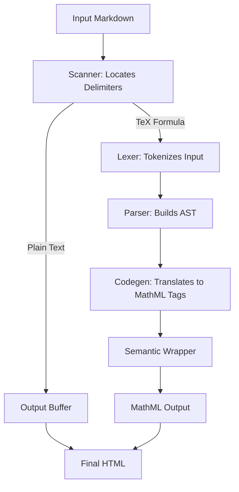
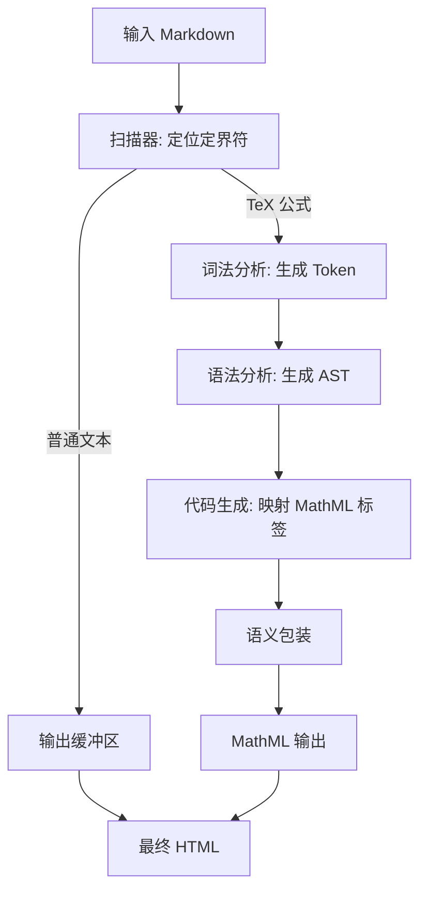

[English](#en) | [中文](#zh)

---

<a id="en"></a>

# @webc.site/math : The world's smallest and fastest web Markdown formula renderer

## 1. Features

This project compiles LaTeX math formulas into browser-native MathML Core markup, achieving zero-overhead rendering without client-side layout engines.

- **High Performance**: Compiles TeX formulas directly to native MathML. Processing speed reaches ~329,000 operations per second, which is approximately 3.6 times faster than KaTeX and 48 times faster than MathJax.
- **Ultra-lightweight**: The package size is 7.78 KB (3.58 KB gzipped), minimizing initial page load times.
- **Zero Runtime Dependencies**: Renders math using the browser's native C++ layout engine instead of loading heavy client-side JavaScript formatting libraries.
- **Robust Fault Tolerance**: Automatically catches syntax errors like unclosed brackets, reverting to raw TeX string output to prevent application crashes.
- **Universal Compatibility**: Generates standard MathML tags suitable for Server-Side Rendering (SSR), Static Site Generation (SSG), and Client-Side Rendering (CSR).

## 2. Usage

### Compilation Examples

#### Render TeX Formulas Directly

```javascript
import mathml from "@webc.site/math";

const html = mathml("e^{i\\pi} + 1 = 0", true); // Second parameter sets block style
```

#### Replace Formulas in Markdown Text

```javascript
import mdMath from "@webc.site/math/md.js";
import compile from "@webc.site/math";

const html = mdMath("Euler's identity: $$e^{i\\pi} + 1 = 0$$", compile);
```

### Font and CSS Configuration

To ensure optimal layout and typesetting, configure math fonts. It is recommended to use the OpenType **Latin Modern Math** font from the `18s` package.

#### CSS Font Styling

```css
math {
  font-family: m, t, math, sans-serif;
}
```

## 3. Design

The compiler extracts TeX math formulas from input Markdown text, runs lexical and syntax analyses, and generates semantic MathML markup.



## 4. Tech Stack

- **Runtime**: Bun, Node.js
- **Linter & Formatter**: oxlint, oxfmt
- **Build Tool**: Vite, Rolldown, Lightning CSS

## 5. Code Structure

```
.
├── demo/                # Interactive demo page
├── extract/             # Test cases extraction scripts
├── lib/                 # Compiled distribution files
│   ├── mathml.js        # Core compiler (minified)
│   └── md.js            # Markdown math formula parser (minified)
├── src/                 # Source code
│   ├── const/           # Tokens, AST types, symbols and functions constants
│   ├── lex.js           # LaTeX lexer
│   ├── parse.js         # LaTeX parser (AST builder)
│   ├── mathml.js        # Core TeX-to-MathML compiler
│   └── md.js            # Markdown parser entry
├── sh/                  # Scripts
│   └── bench/           # Benchmark suites and historical data
└── test.sh              # Quality verification and test runner
```

## 6. Historical Background

In the early history of the World Wide Web Consortium (W3C), MathML was proposed as a standard for mathematical notation in HTML5. However, implementation complexity caused fragmented support across browser engines. Chromium removed its initial MathML code in 2013 due to architectural and security issues, forcing web applications to load large, heavy layout libraries such as MathJax or KaTeX to calculate page styles and position symbols.

A decade later, in January 2023, Chrome 109 reintroduced native support for the MathML Core specification, which defines a subset of MathML optimized for browser performance. With WebKit (Safari), Gecko (Firefox), and Blink (Chrome/Edge) all supporting MathML Core natively, pages no longer require client-side JavaScript layout calculations. This project was created to compile LaTeX directly into native MathML tags at compile time, eliminating layout engine dependencies.

---

<a id="zh"></a>

# @webc.site/math : 全球最小最快的网页Markdown公式渲染器

## 1. 功能介绍

项目将 LaTeX 数学公式编译为浏览器原生支持的 MathML Core 标记，无需前端排版引擎，实现零运行开销渲染。

- **高性能**：直接将 TeX 公式翻译为原生 MathML 标签。处理速度达每秒 329,000 次操作，较 KaTeX 快 3.6 倍，较 MathJax 快 48 倍。
- **体积小**：包体积仅 7.78 KB（Gzip 压缩后 3.58 KB），不影响页面首次加载性能。
- **无运行时依赖**：利用浏览器底层的 C++ 原生引擎进行布局和渲染，免去加载前端 JavaScript 排版库的步骤。
- **健壮容错**：自动捕获未闭合括号等语法错误，降级输出原始 TeX 字符串，防止页面程序崩溃。
- **通用兼容**：输出标准的 MathML 元素，适用于服务端渲染（SSR）、静态站点生成（SSG）和前端动态转换。

## 2. 使用演示

### 编译示例

#### 直接渲染 TeX 公式

```javascript
import mathml from "@webc.site/math";

const html = mathml("e^{i\\pi} + 1 = 0", true); // 第二参数设为 true 表示块级公式
```

#### 替换 Markdown 文本中的公式

```javascript
import mdMath from "@webc.site/math/md.js";
import compile from "@webc.site/math";

const html = mdMath("欧拉恒等式：$$e^{i\\pi} + 1 = 0$$", compile);
```

### 字体与 CSS 配置

配置数学字体可确保排版美观。推荐使用 `18s` 字体包中的 **Latin Modern Math** 字体。

#### CSS 字体样式设置

```css
math {
  font-family: m, t, math, sans-serif;
}
```

## 3. 设计思路

编译器从输入的 Markdown 文本中提取 TeX 公式，执行词法分析和语法分析，生成对应的语义化 MathML 标记。



## 4. 技术栈

- **运行环境**：Bun, Node.js
- **语法检查与格式化**：oxlint, oxfmt
- **构建工具**：Vite, Rolldown, Lightning CSS

## 5. 代码结构

```
.
├── demo/                # 演示页面
├── extract/             # 测试用例提取脚本
├── lib/                 # 编译产物目录
│   ├── mathml.js        # 核心编译器（压缩版）
│   └── md.js            # Markdown 公式解析器（压缩版）
├── src/                 # 源代码
│   ├── const/           # Token、AST 节点、符号和函数常量定义
│   ├── lex.js           # LaTeX 词法分析器
│   ├── parse.js         # LaTeX 语法分析器（生成 AST）
│   ├── mathml.js        # TeX 至 MathML 核心编译器
│   └── md.js            # Markdown 公式解析入口
├── sh/                  # 脚本目录
│   └── bench/           # 性能基准测试与历史数据
└── test.sh              # 代码规范检查与测试运行脚本
```

## 6. 历史故事

在万维网联盟（W3C）早期历史中，MathML 曾被提议为 HTML5 标准数学排版规范。但因其实现复杂度高，各浏览器引擎对该规范的支持程度参差不齐。2013 年，Chromium 项目以系统架构和安全隐患为由移除了原有的 MathML 渲染实现。导致网页渲染公式时，必须依赖 MathJax 或 KaTeX 等体积庞大的 JavaScript 排版库在前端进行复杂的样式布局和字符定位计算。

十年后，即 2023 年 1 月，Chrome 109 重新引入了对 MathML Core 标准的原生支持。该标准精简并优化了数学渲染逻辑，使其在现代浏览器引擎中表现更为高效。随着 WebKit (Safari)、Gecko (Firefox) 和 Blink (Chrome/Edge) 对 MathML Core 规范实现全面覆盖，前端不再需要引入重型的 JavaScript 排版引擎。该项目应运而生，在编译期将 LaTeX 直接转换为原生 MathML 标签，去除运行时排版库依赖。
