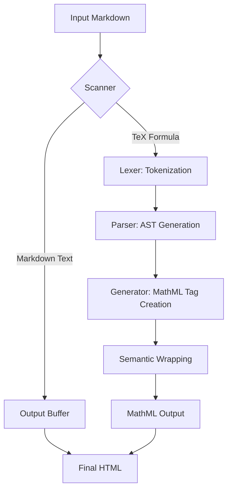

# @webc.site/math

### The world's smallest and fastest web Markdown formula renderer

<a href="https://www.npmjs.com/package/@webc.site/math" target="_blank"></a>
&nbsp;&nbsp;
<a href="https://github.com/webc-site/math" target="_blank"></a>
&nbsp;&nbsp;
<a href="https://math.webc.site" target="_blank"></a>

The world's smallest and fastest web Markdown formula renderer designed to parse mathematical formulas within Markdown text.

- [Usage](#usage)
- [Features](#features)
- [Supported Syntax List](#supported-syntax-list)
- [What is MathML?](#what-is-mathml)
  - [Why Compile TeX Formulas to MathML?](#why-compile-tex-formulas-to-mathml)
- [Benchmark](#benchmark)
- [Design and Calling Process](#design-and-calling-process)
- [How to Add Syntax Support](#how-to-add-syntax-support)
- [Tech Stack](#tech-stack)
- [Directory Structure](#directory-structure)
- [History and Background](#history-and-background)

## Usage

### JavaScript Example

#### 1. Replace Formulas in Markdown (using `@webc.site/math/md`)

Parses Markdown text, automatically identifying and replacing inline/block equations with MathML.

```javascript
import mdMath from "@webc.site/math/md";

const markdown = "Euler's identity: $$e^{i\\pi} + 1 = 0$$";
const html = mdMath(markdown);

console.log(html);
// Output: Euler's identity: <math xmlns="http://www.w3.org/1998/Math/MathML" display="block"><semantics><mrow><msup><mi>e</mi><mrow><mi>i</mi><mi>π</mi></mrow></msup><mo>+</mo><mn>1</mn><mo>=</mo><mn>0</mn></mrow><annotation encoding="application/x-tex">e^{i\pi} + 1 = 0</annotation></semantics></math>
```

#### 2. Render TeX Formulas Directly (using `@webc.site/math`)

Compiles TeX formulas directly to MathML. Useful for implementing math rendering plugins for Markdown parsers (e.g., markdown-it, marked).

```javascript
import mathml from "@webc.site/math";

const tex = "e^{i\\pi} + 1 = 0";
const html = mathml(tex, true); // true for block math, false/empty for inline math
```

### CSS and Math Font Configuration

For browser mathematical layout engines to present beautifully typeset math equations, we highly recommend using a math font. The **Latin Modern Math** font provided in the `18s` package is recommended (derived from Knuth's classical Computer Modern typeface, with a complete mathematical symbol set and OpenType MATH table support).

#### 1. Online Reference (Recommended)

You can import the online font directly in your CSS:

```css
/* Import the bundle (includes Source Han Sans t, monospace c, and math font m) */
@import url("//registry.npmmirror.com/18s/0.2.24/files/_.css");
```

Or import the math font `m` only:

```css
@import url("//registry.npmmirror.com/18s/0.2.24/files/m.css");
```

#### 2. Local Installation

```bash
npm install 18s
```

##### Import Local Font

Depending on your project setup, choose one of the following methods to import the font mappings (Note: do not mix JS and CSS imports in the same file):

###### Method 1: Import in JS/TS Entry File

```javascript
// Import the bundle (includes Source Han Sans t, monospace c, and math font m)
import "18s/_.css";
```

Or import math font `m` only:

```javascript
import "18s/m.css";
```

###### Method 2: Import in CSS Stylesheet

```css
/* Import the bundle (includes Source Han Sans t, monospace c, and math font m) */
@import "18s/_.css";
```

Or import math font `m` only:

```css
@import "18s/m.css";
```

#### 3. Configure CSS Style

Set the `math` tag to use font family alias `m` (where `t` is Source Han Sans, optimized with font slicing for Chinese characters) in your global CSS styles:

```css
math {
  /* m is the math font, t is Source Han Sans (optimized with font slicing for Chinese characters to boost loading performance), sans-serif is default fallback */
  font-family: m, t, sans-serif;
}
```

## Features

- **Highly Complete Features**: Extracted and compiled thousands of mathematical formulas from KaTeX and MathJax official test suites, passing all test cases successfully (see [extract](https://github.com/webc-site/math/tree/dev/extract) for details).
- **Robust & Fault-Tolerant**: When parsing Markdown text, syntax errors (such as unclosed `\left`/`\right` or invalid syntax) are caught automatically and gracefully degraded, returning the raw TeX code to prevent application crashes.
- **Fast Compiler**: Compiles TeX formulas directly to semantic MathML without external parser dependencies.
- **Markdown Integration**: Automatically parses inline math (`$formula$`) and block math (`$$formula$$`) in Markdown text.
- **High Performance**: Only 7.78 KB raw size (3.58 KB gzipped), far smaller than KaTeX and MathJax (see size comparison chart below):

  | Library                                                     | Raw Size  | Gzip Size | Size Ratio |
  | :---------------------------------------------------------- | :-------: | :-------: | :--------: |
  | [@webc.site/math](https://github.com/webc-site/math) (Ours) |  7.78 KB  |  3.58 KB  |   1.0 ⭐️   |
  | [KaTeX](https://github.com/KaTeX/KaTeX)                     | 264.79 KB | 75.15 KB  |    21.0    |
  | [MathJax](https://github.com/mathjax/MathJax)               | 971.04 KB | 278.39 KB |    77.7    |

  

- **Standard Compatibility**: Outputs valid MathML elements supported by modern browser layout engines.

## Supported Syntax List

Designed to be extremely lightweight, this library supports the most commonly used math typesetting syntaxes:

- **Basic Arithmetic & Symbols**: Numbers, English letters, basic operators (`+`, `-`, `*`, `/`, `=`, `<`, `>`, `(`, `)`, `[`, `]`, `.`). Note that `-` automatically maps to minus sign `\u2212`, `*` maps to asterisk `\u2217`, and `/` is rendered in upright normal font.
- **Subscripts & Superscripts**:
  - Superscript `^` (e.g., `x^2`)
  - Subscript `_` (e.g., `x_i`)
  - Simultaneous subscripts/superscripts (e.g., `x_i^2` or `x^2_i`)
  - Big operators automatically render limits layout for subscripts and superscripts (e.g., `\sum_{i=1}^n`, `\int_a^b`)
- **Fractions**: `\frac{numerator}{denominator}` (e.g., `\frac{a}{b}`)
- **Square Roots**: Square root `\sqrt{x}` and $n$-th root `\sqrt[n]{x}`
- **Overlines & Bars**: `\overline{x}` and the shorthand `\bar{x}`
- **Adaptive Delimiters**: `\left` and `\right` structures for autosizing delimiters (e.g., `\left( ... \right)`). Supported delimiters include:
  - Parentheses: `(` and `)`
  - Square brackets: `[` and `]`
  - Curly braces: `\{` and `\}`
  - Angle brackets: `<` (⟨) and `>` (⟩)
  - Vertical bars: `|` or `\|`
  - Null/Empty delimiter: `.` (shows no delimiter on that side, e.g., `\left. \frac{df}{dx} \right| _0`)
- **Text Mode**: `\text{...}` (e.g., `\text{if }`), extracts literal text inside braces and renders it as MathML `<mtext>` in normal upright font.
- **Horizontal Spacing**: Supports `\quad` (1em space) and `\qquad` (2em space) horizontal spacing.
- **Styles, Strikethroughs & Phantom**:
  - Borders: `\boxed{...}` (adds a border around the formula, e.g., `\boxed{x+y}`)
  - Strikethroughs: `\cancel{...}` (crosses out with a diagonal line, e.g., `\cancel{x}`) and `\sout{...}` (crosses out with a horizontal line, e.g., `\sout{y}`)
  - Hiding & Spacing: `\phantom{...}` (renders an invisible placeholder with the same width and height as the argument, e.g., `\phantom{x}`)
- **Common Functions**: `\sin`, `\cos`, `\tan`, `\cot`, `\sec`, `\csc`, `\log`, `\lg`, `\ln`, `\lim`, `\exp`, `\max`, `\min`, `\sup`, `\inf`, `\det`, `\gcd`, `\arcsin`, `\arccos`, `\arctan`, `\sinh`, `\cosh`, `\tanh`, `\coth`, `\deg`, `\arg`. Note that limit-like operators (`\lim`, `\max`, `\min`, `\sup`, `\inf`) render with limits layout (above/under) for subscripts and superscripts in display/block math mode.
- **Modulo parentheses**: `\pmod{...}` (generates parenthesized modulo, e.g., `\pmod{m}` renders as $(mod\ m)$)
- **Greek Letters**:
  - Lowercase: `\alpha` ($\alpha$), `\beta` ($\beta$), `\gamma` ($\gamma$), `\delta` ($\delta$), `\epsilon` ($\epsilon$), `\zeta` ($\zeta$), `\eta` ($\eta$), `\theta` ($\theta$), `\iota` ($\iota$), `\kappa` ($\kappa$), `\lambda` ($\lambda$), `\mu` ($\mu$), `\nu` ($\nu$), `\xi` ($\xi$), `\pi` ($\pi$), `\rho` ($\rho$), `\sigma` ($\sigma$), `\tau` ($\tau$), `\upsilon` ($\upsilon$), `\phi` ($\phi$), `\chi` ($\chi$), `\psi` ($\psi$), `\omega` ($\omega$)
  - Uppercase (rendered upright): `\Delta` ($\Delta$), `\Gamma` ($\Gamma$), `\Theta` ($\Theta$), `\Lambda` ($\Lambda$), `\Xi` ($\Xi$), `\Pi` ($\Pi$), `\Sigma` ($\Sigma$), `\Upsilon` ($\Upsilon$), `\Phi` ($\Phi$), `\Psi` ($\Psi$), `\Omega` ($\Omega$)
- **Operators & Relations**:
  - `\le` / `\leq` ($\le$), `\ge` / `\geq` ($\ge$), `\ne` / `\neq` ($\ne$)
  - `\cdot` ($\cdot$), `\times` ($\times$), `\pm` ($\pm$), `\mp` ($\mp$), `\div` ($\div$), `\infty` ($\infty$)
  - `\approx` ($\approx$), `\sim` ($\sim$), `\cong` ($\cong$), `\propto` ($\propto$), `\equiv` ($\equiv$), `\perp` ($\perp$), `\parallel` ($\parallel$)
- **Calculus, Sets & Logic**:
  - Gradient: `\nabla` ($\nabla$), Partial derivative: `\partial` ($\partial$)
  - Logic quantifiers & operations: `\forall` ($\forall$), `\exists` ($\exists$), `\neg` ($\neg$), `\land` ($\land$), `\lor` ($\lor$)
  - Set relations: `\in` ($\in$), `\notin` ($\notin$), `\ni` ($\ni$), `\subset` ($\subset$), `\supset` ($\supset$), `\subseteq` ($\subseteq$), `\supseteq` ($\supseteq$)
  - Set operations: `\cup` ($\cup$), `\cap` ($\cap$), Empty set: `\emptyset` ($\emptyset$)
  - Special variables & constants: `\ell` ($\ell$), `\hbar` ($\hbar$)
  - Big operators: summation `\sum` ($\sum$), integral `\int` ($\int$)
- **Arrows**:
  - Unidirectional: `\to` / `\rightarrow` ($\rightarrow$), `\leftarrow` / `\gets` ($\leftarrow$), `\Leftarrow` ($\Leftarrow$), `\Rightarrow` ($\Rightarrow$)
  - Bidirectional: `\leftrightarrow` ($\leftrightarrow$), `\Leftrightarrow` ($\Leftrightarrow$)
- **Ellipses (Dots)**:
  - Baseline dots: `\dots` / `\ldots` ($\dots$)
  - Center dots: `\cdots` ($\cdots$)
- **Matrices & Multi-line Layouts**:
  - Matrix environments: `matrix`, `pmatrix`, `bmatrix`, `vmatrix`, `Vmatrix` (e.g., `\begin{pmatrix} a & b \\ c & d \end{pmatrix}`)
  - Systems of equations & conditional branches: `cases` (e.g., `\begin{cases} x & x \ge 0 \\ -x & x < 0 \end{cases}`)
  - General-purpose array layouts: `array`
  - Line breaks & alignments: use `\\`, `\\*`, or `\\[width]` (for custom row spacing, e.g. `\\[10px]`) for line breaks, and `&` for column alignments

### Unsupported Syntax (Non-Goals)

Currently, the following LaTeX extensions, macro definitions, or custom styling commands are not supported:

1. **Macro Definitions**: `\newcommand`, `\renewcommand`, `\providecommand`, `\gdef`, `\let`, etc.
2. **Background Colors & Advanced Borders**: `\colorbox`, `\fcolorbox`, `\cellcolor`, etc. (while `\boxed` is supported).
3. **Other Strikethroughs**: `\bcancel`, `\xcancel`, etc. (while `\cancel` and `\sout` are supported).
4. **Advanced Layouts & Spacing**: `\hphantom`, `\vphantom`, `\smash`, etc. (while `\phantom` is supported).
5. **Chemistry Package Extensions**: Chemical formula macros like `\ce{...}` (mhchem).
6. **Verbatim Text**: `\verb`, etc.
7. **Advanced Positionings**: `\sideset`, `\prescript`, `\cramped`, `\flatfrac`, etc.
8. **Equation Numbering & Custom Tags**: `\tag`, `\newtagform`, `\usetagform`, etc.
9. **Arbitrary Operator Limits**: Except for predefined big operators (`\sum`, `\int`) and limit-like operators (`\lim`), using `\limits` on arbitrary commands or structures (e.g., `\operatorname{sn}\limits_{...}`) is not supported.

## Error Handling and Fault Tolerance

When parsing Markdown text using `@webc.site/math/md`, if a mathematical formula contains invalid LaTeX syntax (such as an unclosed `\left`), the parser automatically catches the compilation error internally and gracefully falls back to displaying the raw formula text (e.g., `$$x + \left( y$$`). This ensures that a single syntax error in a formula won't throw JavaScript exceptions or crash your application. Therefore, you **do not** need to wrap it in a `try...catch` block when calling this function.

Note that calling `@webc.site/math` (the TeX compiler core) directly with invalid LaTeX syntax will throw an array containing an error code (see the internal error codes table below). If you are using the core TeX compiler directly, it is recommended to wrap the call in a `try...catch` block.

### Internal Error Codes

The following error codes are used internally during the compilation phase to signal specific syntax issues. These are primarily useful for development, debugging, and testing:

| Error Code | Constant            | Description                                   | Trigger Example                       |
| :--------: | :------------------ | :-------------------------------------------- | :------------------------------------ |
|    `0`     | `ERR_EXTRA_END`     | Extra or invalid `\end` command               | `\end{matrix}` (no matching `\begin`) |
|    `1`     | `ERR_MISSING_RIGHT` | `\left` delimiter missing a matching `\right` | `\left( x`                            |
|    `2`     | `ERR_EXTRA_RIGHT`   | Extra or invalid `\right` command             | `x \right)` (no matching `\left`)     |
|    `3`     | `ERR_MISSING_BRACE` | Command missing required curly brace `{}`     | `\text x` (missing braces)            |

## What is MathML?

MathML (Mathematical Markup Language) is an XML-based standard for describing mathematical notations and capturing both its structure and content on the web.

**Since January 2023** (with the release of Chrome 109 and native Blink engine support), MathML Core has been fully supported natively across all three major web rendering engines (Chromium/Blink, Gecko/Firefox, and WebKit/Safari). This ensures highly efficient and native rendering of mathematical equations across most desktop/mobile devices and modern browser versions without needing heavy client-side JavaScript rendering engines.

### Why Compile TeX Formulas to MathML?

While MathML is the native web standard for mathematical typesetting, its XML-based syntax is too verbose for direct human authoring. TeX/LaTeX syntax remains the de facto standard for writing mathematical formulas (e.g., writing `$e^{i\pi} + 1 = 0$` in Markdown).

Traditional web math solutions (such as MathJax or KaTeX) require loading hundreds of kilobytes to several megabytes of JS/CSS typesetting engines in the frontend, consuming substantial client-side CPU cycles for DOM mutations and layout calculations.

By compiling TeX directly to native MathML using `@webc.site/math`, you get the best of both worlds—especially in **client-side (frontend) rendering** scenarios:

#### 1. Extremely Lightweight (~1.8 KB Gzip) & Zero Dependencies

Compared to KaTeX (300 KB+) and MathJax (several MBs), `@webc.site/math` has a virtually negligible footprint. It can be bundled directly into any frontend/SPA app without hurting initial page load times.

#### 2. Native Browser Layout (No Heavy Client-Side Rendering Engine)

Traditional math libraries pack not only a TeX parser but also a heavy client-side layout engine to calculate font metrics, alignment, and spacing, producing massive DOM trees or SVG elements.
Our compiler acts as a translator that turns TeX into standard MathML tags on the client, leaving all the heavy rendering, typography, and positioning tasks to the browser's native C++ layout engine. This drastically reduces JavaScript execution time.

#### 3. Seamless Real-Time Frontend Previews & Low CPU Overhead

Because the compilation is purely a fast tag-mapping step and layout is handled natively, CPU usage is minimal. This makes it ideal for **WYSIWYG editors, live markdown previewers, and interactive apps** where formulas need to be rendered dynamically on every keystroke without lag—even on low-end mobile devices.

#### 4. Unified Frontend and SSR Capabilities

Since the output is standard HTML with MathML elements, the same compiler works seamlessly for dynamic client-side rendering (CSR), server-side rendering (SSR), and static site generation (SSG) alike.

## Benchmark

Since KaTeX and MathJax are pure TeX compilers (without Markdown parsing features), to ensure a fair comparison, our benchmark directly compares the TeX compiler core ([@webc.site/math/mathml.js](https://github.com/webc-site/math/blob/dev/src/mathml.js)) against them.

### 1. Size Comparison (Gzipped)

| Library                                       | Raw Size  | Gzip Size | Size Ratio |
| :-------------------------------------------- | :-------: | :-------: | :--------: |
| @webc.site/math (Ours)                        |  7.78 KB  |  3.58 KB  |   1.0 ⭐️   |
| [KaTeX](https://github.com/KaTeX/KaTeX)       | 264.79 KB | 75.15 KB  |    21.0    |
| [MathJax](https://github.com/mathjax/MathJax) | 971.04 KB | 278.39 KB |    77.7    |


### 2. Compilation Speed (Ops/sec)

Based on compiling standard test equations (measured using [sh/benchmark.js](https://github.com/webc-site/math/blob/dev/sh/benchmark.js)):

- **@webc.site/math (Ours)**: ~329, 000 ops/s (1.0 ⭐️)
- **[KaTeX](https://github.com/KaTeX/KaTeX)**: ~92, 000 ops/s (~3.6x slower)
- **[MathJax](https://github.com/mathjax/MathJax)**: ~6, 700 ops/s (~48.8x slower)


## Design and Calling Process

The parser processes input Markdown string, isolates TeX expressions, and translates them to MathML structures.



### Module Flow

1. **Scanner**: Scans the input string to locate delimiters (`$` and `$$`).
2. **Lexer**: Tokenizes TeX string into numbers, variables, operations, and control characters.
3. **Parser**: Converts tokens into Abstract Syntax Tree (AST) nodes supporting fractions, subscripts, superscripts, and functions.
4. **Generator**: Converts AST nodes to standardized XML nodes (`<mi>`, `<mo>`, `<mn>`, `<mfrac>`, `<msup>`, `<msub>`, `<msubsup>`).

## How to Add Syntax Support

To add support for a new LaTeX syntax, you need to modify the following four core parts in order:

### 1. Constants

Define the corresponding lexical tokens, syntax node types, function names, or symbol mappings:

- **Token Type**: Defined in [const/TOK.js](https://github.com/webc-site/math/blob/dev/src/const/TOK.js) (e.g., `export const TOK_MY_CMD = ...` if a new lexical category is required).
- **AST Node Type**: Defined in [const/TYPE.js](https://github.com/webc-site/math/blob/dev/src/const/TYPE.js) (e.g., `export const TYPE_MY_NODE = ...` specifies the new abstract syntax tree node type).
- **Environment Delimiters**: If adding a new environment (such as a matrix variant), configure its left and right delimiters in `ENV_DELIMS` inside [mathml.js](https://github.com/webc-site/math/blob/dev/src/mathml.js) (previously `compile.js`).
- **Symbol Map**: For simple math symbols or commands, map the command name to its corresponding Unicode character in `SYM_MAP` inside [const/SYM.js](https://github.com/webc-site/math/blob/dev/src/const/SYM.js).
- **Function Names**: Defined in [const/FUNC.js](https://github.com/webc-site/math/blob/dev/src/const/FUNC.js) (under `FUNC_NAMES`).

### 2. Lexer

The `lex(str)` function tokenizes the LaTeX input string into a flat token array. It is located in [lex.js](https://github.com/webc-site/math/blob/dev/src/lex.js).

- If you introduce new special characters or structures, update the character matching logic in `lex` to recognize and push the corresponding `TOK_*` type and its literal value to the `tokens` array.

### 3. Parser

The `parse(tokens, state)` function parses tokens into AST nodes. It is located in [parse.js](https://github.com/webc-site/math/blob/dev/src/parse.js).

- **Command Parsing**: Handled in the `TOK_MAP[TOK_CMD]` function inside [parse.js](https://github.com/webc-site/math/blob/dev/src/parse.js). When a command (e.g., `\mycmd`) is matched, consume its arguments (using `read(tokens, state_ref)` or `grab(tokens, state_ref)`) and return an AST node array: `[TYPE_MY_NODE, arg1, arg2]`.

### 4. Renderer

The `SHOW_MAP` dictionary converts AST nodes into standard MathML markup strings. It is located in [mathml.js](https://github.com/webc-site/math/blob/dev/src/mathml.js) (previously `compile.js`).

- Register a new renderer function: `[TYPE_MY_NODE]: ([_, arg1, arg2]) => nest("mylabel", arg1, arg2)` or `tag("mi", ...)` to format node data into standard MathML tags (e.g., `<mfrac>`, `<msup>`, etc.).

## Tech Stack

- **Runtime**: Bun, Node.js
- **Compilation & Bundling**: SWC (minify), Vite (demo)
- **Development Tools**: oxlint, oxfmt

## Directory Structure

```
.
├── demo/                # Interactive rendering demo site
│   ├── const/           # Constants (formulas, languages)
│   ├── i18n/            # Internationalization translation files
│   ├── index.js         # Demo interaction script
│   ├── index.pug        # Pug HTML template
│   └── style.styl       # Premium layout styling
├── extract/             # Classical formula extraction scripts (KaTeX / MathJax test cases)
├── lib/                 # Compiled production distribution
│   ├── package.json     # Minified package.json for NPM publication
│   ├── README.md        # Automatically synchronized README for publication
│   ├── mathml.js        # Minified distribution JS (TeX compiler)
│   ├── mathml.js.map    # Source map for TeX compiler
│   ├── md.js            # Minified distribution JS (Markdown parser)
│   └── md.js.map        # Source map for Markdown parser
├── src/                 # Source code
│   ├── const/           # Constant definitions (types, symbols, functions, etc.)
│   ├── lex.js           # LaTeX formula lexer
│   ├── parse.js         # LaTeX formula parser (AST generator)
│   ├── mathml.js        # TeX-to-MathML compiler
│   └── md.js            # Markdown math formula parser entry point
├── sh/                  # Shell scripts
│   ├── benchmark.js     # Size comparison benchmark & SVG generation script
│   └── check.js         # Language file validation script
├── dev.js               # Programmatic Vite development server launcher
├── dist.js              # Build & distribution helper script (bumps version, compiles templates)
├── minify.js            # Build minification compiler script
├── package.json         # Project configuration metadata
├── README.md            # Synchronized root project documentation
├── README.mdt           # Markdown template for compiling English, Chinese and About files
└── test.sh              # Formatter, linter, and compiler test runner
```

## History and Background

Mathematical typesetting on the web has historically relied on heavy libraries like MathJax or KaTeX. These libraries fetch large bundles and execute extensive CSS and layout calculations, causing page loading latencies.

MathML (Mathematical Markup Language) was proposed to solve this by providing native browser rendering of mathematical notations. In 2023, the integration of MathML Core into the Blink layout engine completed native MathML support across major web browsers (Chrome, Safari, Firefox).

The `18s` project provides a optimized math font `m` (Latin Modern Math, derived from Donald Knuth's Computer Modern typeface). The `@webc.site/math` compiler compiles TeX equations directly to native MathML Core elements, leveraging browser rendering capabilities to eliminate heavyweight runtime rendering dependencies.
